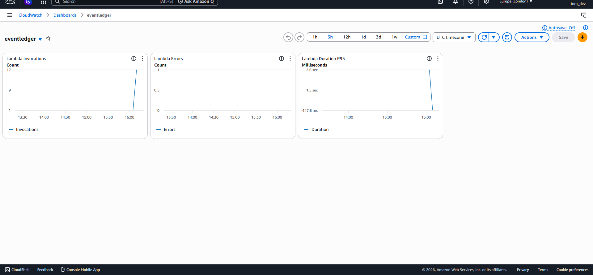

# eventledger

Serverless security event ingestion API built on AWS. Accepts structured security events via HTTP, validates them, and stores them in DynamoDB with a timestamp and unique ID.

Built with AWS Lambda, API Gateway, and DynamoDB. Deployed as infrastructure as code using AWS CDK (Python).

## Architecture

POST /events → API Gateway → Lambda (`ingest.py`) → DynamoDB

## Event schema

```json
{
  "source": "auth-service",
  "severity": "high",
  "message": "multiple failed login attempts detected"
}
```

The API validates the required fields `source`, `severity`, and `message`.

Accepted severity levels: `low`, `medium`, `high`, `critical`

## Run tests

```bash
pip install -r requirements-dev.txt
python -m pytest tests -v
```

## Deploy

```bash
pip install -r requirements.txt
cdk bootstrap
cdk deploy
```

## Example request

```powershell
Invoke-RestMethod -Uri "https://uicfjxipwl.execute-api.eu-west-2.amazonaws.com/prod/events" -Method POST -ContentType "application/json" -Body '{"source":"auth-service","severity":"high","message":"multiple failed login attempts detected"}'
```

## Monitoring

CloudWatch dashboard tracks Lambda invocations, errors, and duration (P95).



## Stack

- **API Gateway** — REST API with a single `POST /events` endpoint
- **Lambda** — Python 3.12 function that validates and writes events
- **DynamoDB** — on-demand table storing event records
- **CloudWatch** — dashboard with invocation count, error rate, and duration (P95)